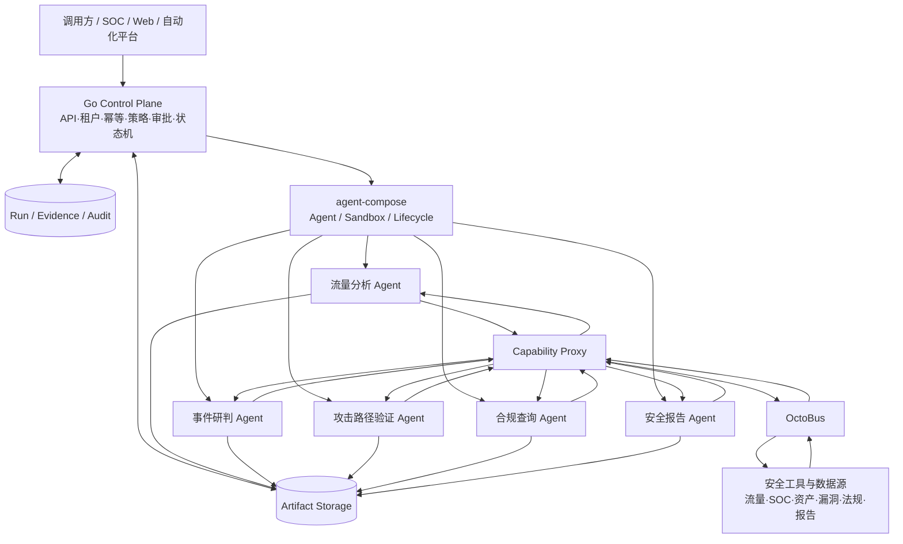
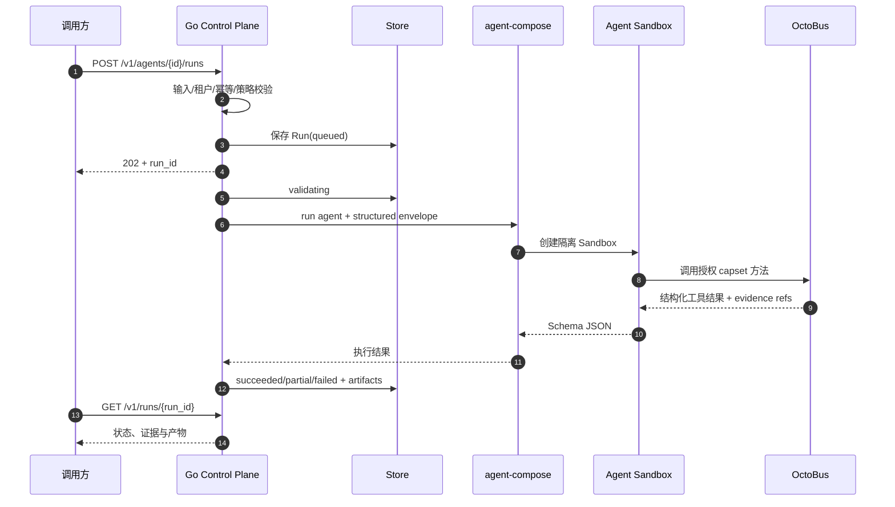
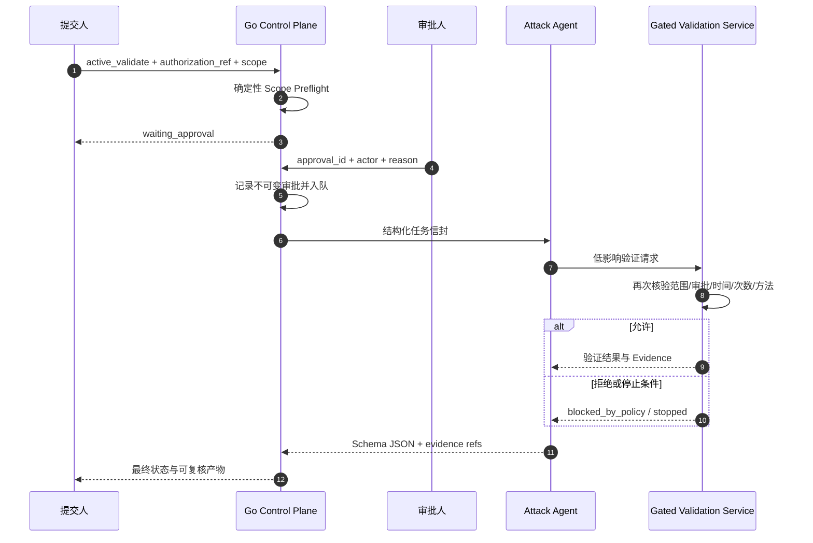
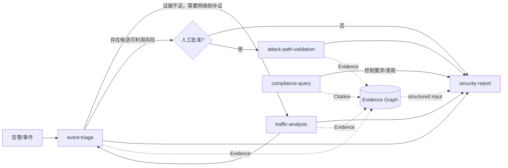

# 架构与流程图

## 1. 总体逻辑

```mermaid
flowchart TB
    Caller[调用方 / SOC / Web / 自动化平台]
    Gateway[Go Control Plane<br/>API·租户·幂等·策略·审批·状态机]
    Store[(Run / Evidence / Audit)]
    Artifact[(Artifact Storage)]
    AC[agent-compose<br/>Agent / Sandbox / Lifecycle]
    Proxy[Capability Proxy]
    OB[OctoBus]

    A1[流量分析 Agent]
    A2[事件研判 Agent]
    A3[攻击路径验证 Agent]
    A4[合规查询 Agent]
    A5[安全报告 Agent]

    Tools[安全工具与数据源<br/>流量·SOC·资产·漏洞·法规·报告]

    Caller --> Gateway
    Gateway <--> Store
    Gateway <--> Artifact
    Gateway --> AC
    AC --> A1
    AC --> A2
    AC --> A3
    AC --> A4
    AC --> A5
    A1 --> Proxy
    A2 --> Proxy
    A3 --> Proxy
    A4 --> Proxy
    A5 --> Proxy
    Proxy --> OB
    OB --> Tools
    Tools --> OB
    OB --> Proxy
    Proxy --> A1
    Proxy --> A2
    Proxy --> A3
    Proxy --> A4
    Proxy --> A5
    A1 --> Artifact
    A2 --> Artifact
    A3 --> Artifact
    A4 --> Artifact
    A5 --> Artifact
```

## 2. 普通只读任务

```mermaid
sequenceDiagram
    autonumber
    participant C as 调用方
    participant G as Go Control Plane
    participant S as Store
    participant A as agent-compose
    participant X as Agent Sandbox
    participant O as OctoBus

    C->>G: POST /v1/agents/{id}/runs
    G->>G: 输入/租户/幂等/策略校验
    G->>S: 保存 Run(queued)
    G-->>C: 202 + run_id
    G->>S: validating
    G->>A: run agent + structured envelope
    A->>X: 创建隔离 Sandbox
    X->>O: 调用授权 capset 方法
    O-->>X: 结构化工具结果 + evidence refs
    X-->>A: Schema JSON
    A-->>G: 执行结果
    G->>S: succeeded/partial/failed + artifacts
    C->>G: GET /v1/runs/{run_id}
    G-->>C: 状态、证据与产物
```

## 3. 主动攻击验证

```mermaid
sequenceDiagram
    autonumber
    participant C as 提交人
    participant G as Go Control Plane
    participant P as 审批人
    participant A as Attack Agent
    participant O as Gated Validation Service

    C->>G: active_validate + authorization_ref + scope
    G->>G: 确定性 Scope Preflight
    G-->>C: waiting_approval
    P->>G: approval_id + actor + reason
    G->>G: 记录不可变审批并入队
    G->>A: 结构化任务信封
    A->>O: 低影响验证请求
    O->>O: 再次核验范围/审批/时间/次数/方法
    alt 允许
        O-->>A: 验证结果与 Evidence
    else 拒绝或停止条件
        O-->>A: blocked_by_policy / stopped
    end
    A-->>G: Schema JSON + evidence refs
    G-->>C: 最终状态与可复核产物
```

## 4. 跨智能体闭环

```mermaid
flowchart LR
    Alert[告警/事件] --> Triage[event-triage]
    Triage -->|证据不足，需要网络侧补证| Traffic[traffic-analysis]
    Traffic --> Triage
    Triage -->|存在候选可利用风险| Gate{人工批准?}
    Gate -->|否| Report[security-report]
    Gate -->|是| Attack[attack-path-validation]
    Attack --> Report
    Triage --> Report
    Traffic --> Report
    Compliance[compliance-query] -->|控制要求/差距| Report

    Triage -. Evidence .-> Evidence[(Evidence Graph)]
    Traffic -. Evidence .-> Evidence
    Attack -. Evidence .-> Evidence
    Compliance -. Citation .-> Evidence
    Evidence -. structured input .-> Report
```

跨智能体调用必须由显式 Workflow 发起；任何 Agent 都不能自行绕过审批调用主动验证能力。
