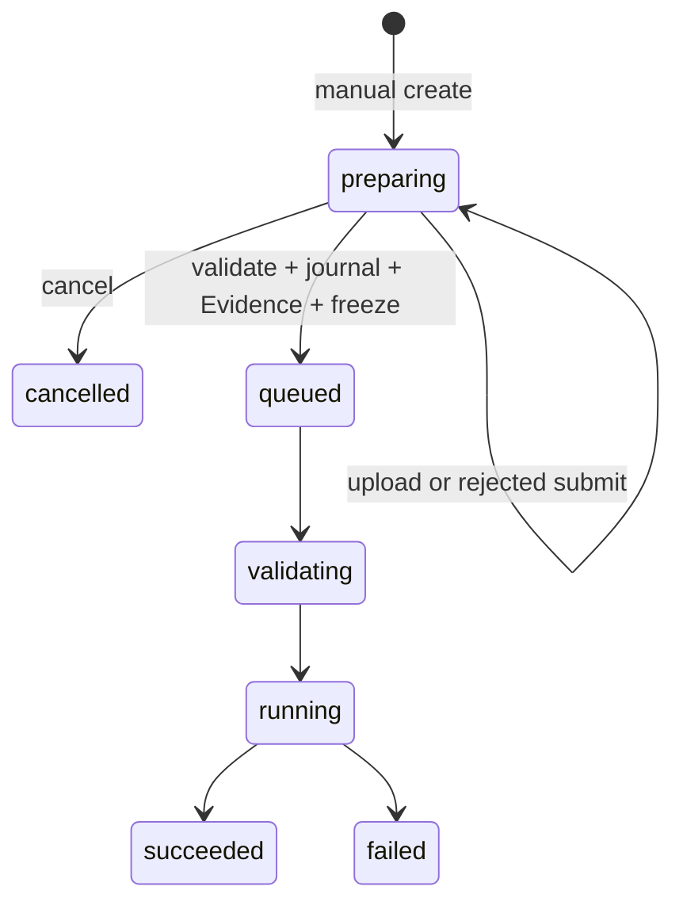

# Manual input preparation (offline)

Behavior is defined by [issue #70](https://github.com/Notyet1307/security-agent-suite/issues/70); [#72](https://github.com/Notyet1307/security-agent-suite/issues/72) implements it. This runbook describes use and persistence layout, not a second specification. This flow proves input submission, not actual model consumption or security conclusions.



Use an already authorized local Mock endpoint. Keep authentication outside request JSON. The existing `sasctl run --agent event-triage --file request.json` sends a request with `execution_mode: manual` and the chosen fixture's `input_manifest` from [manifest.json](../../evals/input-preparation-v1/manifest.json). Set a fresh `request_id`, `mode: triage`, and matching `scope.tenant_id`; omit URI inputs. Defaults deny network and active validation. No service startup or live runtime is implied by these instructions.

After creation returns `preparing` (201):

```sh
sasctl --tenant TENANT upload RUN_ID --file evals/input-preparation-v1/normal.payload --sha256 MANIFEST_SHA256
sasctl --tenant TENANT submit RUN_ID --artifact-id ARTIFACT_ID
sasctl --tenant TENANT wait RUN_ID
```

Upload sends the exact file bytes, with its basename and `application/json`; it does not submit. `wait` on `preparing` returns immediately with a submit hint. An unknown status is an error. Run creation replay and submission replay return 200; changing the manifest under the same request ID, or selecting another Artifact after submission, returns 409. JSON/schema rejection remains `preparing`; if the frozen manifest describes malformed bytes, create a new request to change that input.

On an internal 500, persistence can be uncertain: query the Run/Artifact listing and retry the same identifiers. Do not generate a new execution as a transport retry. A post-publication Artifact sync failure retains the original bytes; subsequent input reads require successful directory synchronization before trusting them.

## Storage and recovery

- Run JSON lives under `SAS_STATE_DIR/runs/`. `input_manifest`, `creation_fingerprint`, frozen `inputs`, and `submission` are persisted there.
- Private immutable journals live under `SAS_STATE_DIR/input-journals/<run_id>.json` (directory 0700, file 0600). They reserve the candidate Artifact, precise Evidence and submission marker; no public API writes them. Public Evidence append cannot occupy a journal's reserved ID, even from another Run.
- Evidence is immutable under `SAS_STATE_DIR/evidence/`. New filenames derive from the Evidence ID hash, allowing a failed directory sync to retry the same physical record without creating duplicate logical IDs; historical filenames remain readable.
- Artifact data and metadata stay under `SAS_ARTIFACT_DIR`. All dependent publication paths synchronize files and directories; an uncertain published record is never a reason to delete its original bytes.
- Same-node service coordination serializes bounded manual upload, submit, cancellation and public Evidence registration. Queued manual records are the durable notification backlog; a 100 ms dispatcher repairs missed/full-queue notifications. Workers atomically claim queued state, so duplicate notifications do not duplicate execution. The scan and global lock are single-node throughput limits, not HA guarantees.
- Restart leaves `preparing` untouched, including partially written journals/Evidence. The same candidate submit resumes registration. All queued manual inputs are checked before workers start; corrupt/missing frozen records stop startup. Execution rechecks bytes before invoking the executor. Running/validating records use the existing `service_restarted` failure rule, without retries.

## Upgrade, rollback, and evidence

Upgrade the service and strict enum clients/CLI before using manual mode. Old automatic requests and records remain supported. Do not fall back to automatic submission when an old service rejects new fields.

Before rolling back, stop writers and running work and back up the entire Run/Evidence/Artifact/journal set. Old binaries must not open any data directory containing manual records, including terminal ones; restore a consistent pre-manual backup or use an isolated directory. Retain the new-format data for access with the new version. There is no in-place downgrade tool.

Checks are `make verify` and `make race`. Public-API tests use temporary file/memory stores, fixed fixture bytes and a counting test executor, including persistence interruptions and full-queue recovery. Low-level publication checks inject failed directory syncs. These are offline evidence; #73 independent acceptance and real executor input-consumption proof remain separate gates.
